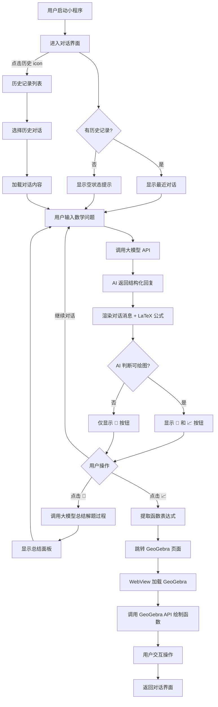

# PRD：MathLearningTool — 高数函数图像解题工具

> 版本：v1.0 | 作者：许清楚（Xu）| 日期：2025-07-09

---

## 1. 项目信息

| 字段 | 值 |
|------|------|
| 项目名称 | MathLearningTool |
| 技术栈 | UniApp + 微信小程序 |
| 项目格式 | snake_case |
| 原始需求 | 高数函数图像解题工具，包含 GeoGebra 交互界面和 AI 对话解题界面，支持 LaTeX 公式渲染、历史对话持久化、解题过程总结、函数图像联动 GeoGebra |

---

## 2. 产品定义

### 2.1 产品目标

1. **可视化解题**：将抽象的高等数学问题（极限、导数、积分等）与函数图像关联，帮助学生直观理解数学概念
2. **智能解题辅助**：通过 AI 大模型输出完整的解题过程，降低高数学习门槛，提升自学效率
3. **交互式探索**：借助 GeoGebra 的动态几何能力，让用户可以交互式地调整函数参数，加深对函数行为的理解

### 2.2 用户故事

1. **作为** 大一学生，**我希望** 输入一道极限题目后，AI 能给出完整的解题过程并自动判断是否可绘制函数图像，**以便** 我同时获得解题思路和直观的图形理解
2. **作为** 备考学生，**我希望** 能将 AI 的解题过程总结为适合手写的书面格式，**以便** 我可以将其整理到笔记本中复习
3. **作为** 数学学习者，**我希望** AI 识别出的函数能一键发送到 GeoGebra 进行交互探索，**以便** 我能通过缩放、拖拽等方式深入理解函数的行为
4. **作为** 长期用户，**我希望** 过往的对话记录能被持久化保存且可随时切换，**以便** 我能回顾之前的学习内容
5. **作为** 高数初学者，**我希望** 对话中的数学公式能以标准数学排版显示，**以便** 我能清晰阅读解题过程中的公式

---

## 3. 需求池

### P0 — 必须有（MVP 核心）

| 编号 | 需求 | 说明 |
|------|------|------|
| P0-1 | AI 对话解题界面 | 核心对话 UI，支持用户输入数学问题、展示 AI 回复 |
| P0-2 | 系统提示词设计 | AI 同时输出：解题过程 + 是否可绘图判断 + 函数表达式 |
| P0-3 | LaTeX 公式渲染 | 对话中正确解析并渲染 LaTeX 数学公式 |
| P0-4 | GeoGebra 交互界面 | 嵌入 GeoGebra，支持函数图像绘制与交互操作 |
| P0-5 | 函数发送到 GeoGebra | 从对话界面将函数表达式传递给 GeoGebra 并自动绘图 |
| P0-6 | 历史对话持久化 | 本地保存对话记录，支持切换历史对话 |

### P1 — 应该有

| 编号 | 需求 | 说明 |
|------|------|------|
| P1-1 | 总结解题过程 | 调用大模型输出适合手写的完整书面解题步骤 |
| P1-2 | 历史记录入口 | 左上角显示历史记录 icon，点击可查看和切换历史对话 |
| P1-3 | 右侧功能按钮区 | 第一轮对话完成后，右侧弹出"总结"和"发送到 GeoGebra"图标 |

### P2 — 可以有

| 编号 | 需求 | 说明 |
|------|------|------|
| P2-1 | 对话搜索 | 在历史记录中搜索关键词 |
| P2-2 | 解题过程导出 | 将总结的解题过程导出为图片或 PDF |
| P2-3 | 多函数叠加绘图 | 在 GeoGebra 中同时绘制多个函数进行对比 |
| P2-4 | 深色模式 | 适配深色模式 |

---

## 4. 功能详细说明

### 4.1 GeoGebra 交互界面

#### 4.1.1 嵌入方案

**推荐方案：WebView 嵌入 GeoGebra Online**

微信小程序支持 `<web-view>` 组件加载 H5 页面。GeoGebra 提供在线版本（https://www.geogebra.org），可通过 WebView 嵌入。

具体实现路径：

1. **方案 A（推荐）**：使用 `<web-view>` 加载自建中间页，中间页内嵌 GeoGebra JavaScript API
   - 优点：可自定义界面、控制交互逻辑、实现与小程序的通信
   - 中间页通过 `wx.miniProgram.postMessage` 与小程序通信
   - 小程序通过 `wx.navigateTo` + URL 参数向中间页传递函数表达式

2. **方案 B**：直接加载 GeoGebra 官方页面
   - 优点：实现简单
   - 缺点：无法精确控制界面、通信受限

**关键约束**：
- 微信小程序 `<web-view>` 要求加载的域名需在小程序管理后台配置业务域名
- `postMessage` 通信仅在特定时机触发（后退、组件销毁、分享），需要配合 URL 参数或轮询机制实现实时通信
- 需在 `geogebra.org` 及其子域名添加到业务域名白名单

#### 4.1.2 交互能力

- 函数绘制：输入函数表达式自动绘制图像
- 缩放/平移：支持手势缩放和拖拽坐标系
- 参数调整：可选支持滑块参数（如 `y = a*sin(x)` 中的 `a`）
- 截图：支持将当前 GeoGebra 画面截图保存

#### 4.1.3 与对话界面的联动机制

```
对话界面 → [函数表达式] → GeoGebra 中间页 → GeoGebra API 绘图
```

- 用户在对话界面点击"发送到 GeoGebra"按钮
- 小程序提取当前函数表达式（如 `y = 1/x`）
- 通过 `wx.navigateTo` 跳转到 GeoGebra 页面，函数表达式作为 URL 参数传递
- GeoGebra 中间页解析 URL 参数，调用 GeoGebra API 执行 `evalCommand("f(x) = 1/x")`
- 如需从 GeoGebra 返回对话界面，使用 `wx.navigateBack`

### 4.2 AI 对话解题界面

#### 4.2.1 界面布局

```
┌─────────────────────────────────┐
│  [历史记录]    高数函数图像解题    │  ← 顶部导航栏
├─────────────────────────────────┤
│                                 │
│   用户: lim 1/x = ?            │  ← 对话消息区
│                                 │
│   AI: 解题过程...               │
│   $$\lim_{x\to\infty}\frac{1}{x}$$ │  ← LaTeX 渲染
│   可绘制函数: y = 1/x          │
│                                 │
│                        [📝] [📈] │  ← 右侧功能按钮（首轮后出现）
│                                 │
├─────────────────────────────────┤
│  [输入框]              [发送]   │  ← 底部输入区
└─────────────────────────────────┘
```

- **顶部导航栏**：左上角历史记录 icon（时钟图标），中间标题
- **对话区**：滚动消息列表，用户消息右对齐，AI 消息左对齐
- **右侧功能按钮**：首轮 AI 回复完成后，在 AI 消息右侧弹出两个悬浮图标
  - 📝 总结解题过程
  - 📈 发送到 GeoGebra（仅当 AI 判断可绘图时显示）
- **底部输入区**：文本输入框 + 发送按钮

#### 4.2.2 历史对话持久化方案

**存储策略**：

| 维度 | 方案 |
|------|------|
| 存储引擎 | `uni.setStorageSync` / `uni.getStorageSync`（微信小程序本地缓存） |
| 存储上限 | 微信小程序单个 key 上限 1MB，总上限 10MB |
| 数据结构 | 每条对话为一个对象，包含 `id`、`title`、`messages[]`、`functions[]`、`createdAt`、`updatedAt` |
| 分页策略 | 每条对话单独存储为一个 key（`chat_${id}`），历史列表存为 `chat_list` |
| 容量管理 | 当存储接近 8MB 时提示用户清理；支持删除单条历史 |
| 对话数量 | 建议单个对话不超过 100 条消息，总对话数不超过 50 条 |

**数据结构示例**：

```json
{
  "id": "chat_1705000000",
  "title": "lim 1/x 的求解",
  "messages": [
    { "role": "user", "content": "lim 1/x = ?", "timestamp": 1705000000 },
    { "role": "assistant", "content": "解题过程...", "latex": ["\\lim_{x\\to\\infty}\\frac{1}{x}"], "hasFunction": true, "functionExpr": "1/x", "timestamp": 1705000001 }
  ],
  "createdAt": 1705000000,
  "updatedAt": 1705000001
}
```

#### 4.2.3 系统提示词（System Prompt）设计

```
你是一个高等数学解题助手。你的任务是：

1. 解答用户提出的高等数学问题，输出完整的解题过程
2. 判断该问题是否涉及可绘制的函数图像
3. 如果涉及函数图像，输出标准函数表达式

输出格式要求：
- 使用 LaTeX 语法书写数学公式，用 $...$ 包裹行内公式，用 $$...$$ 包裹独立公式
- 解题过程需清晰分步，每步标注所用定理或方法

输出结构：
【解题过程】
（分步解题，含 LaTeX 公式）

【图像判断】
可绘制 / 不可绘制

【函数表达式】
（如果可绘制，输出如 y = f(x) 的标准表达式；如果不可绘制，输出"无"）

示例：
用户：lim 1/x = ?
回答：
【解题过程】
求 $\lim_{x \to \infty} \frac{1}{x}$

当 $x \to \infty$ 时，分母趋于无穷大，分子为常数 1。

$$\lim_{x \to \infty} \frac{1}{x} = 0$$

根据极限定义，当 $x$ 趋于无穷大时，$\frac{1}{x}$ 趋于 0。

【图像判断】
可绘制

【函数表达式】
y = 1/x
```

**提示词策略要点**：
- 强制 AI 以结构化格式输出，便于前端解析函数表达式和图像判断
- LaTeX 公式使用 `$...$` / `$$...$$` 标记，便于前端识别和渲染
- 解题过程与元信息（图像判断、函数表达式）分离，方便分别处理

#### 4.2.4 LaTeX 公式渲染方案

**推荐方案：KaTeX（通过 WebView 渲染）**

| 方案 | 优点 | 缺点 | 推荐度 |
|------|------|------|--------|
| KaTeX + WebView | 渲染速度快、支持广泛 | 需 WebView 组件 | ★★★★★ |
| MathJax + WebView | 兼容性最好 | 渲染速度慢、体积大 | ★★★ |
| 自定义 rich-text | 原生渲染 | 实现复杂、覆盖不全 | ★★ |

**具体实现**：

1. 在 AI 消息渲染区域使用 `<web-view>` 或 `<rich-text>` 组件
2. 推荐使用 `mp-html` 插件（UniApp 生态成熟插件），支持 LaTeX 公式渲染
   - 插件地址：`mp-html` 社区版支持微信小程序
   - 集成 KaTeX 预编译，将 LaTeX 转为 HTML 后通过 `rich-text` 渲染
3. 前端解析 AI 回复中的 `$...$` 和 `$$...$$` 标记，替换为 KaTeX 渲染后的 HTML

**备选方案**：
- 使用 `latex-parser` 将 LaTeX 转为图片，通过 `<image>` 组件显示
- 适用于极端兼容性需求，但体验较差

#### 4.2.5 第一轮对话后的功能按钮

**触发条件**：AI 完成首轮回复后，在 AI 消息区域右侧弹出两个悬浮图标。

**按钮一：📝 总结解题过程**

- 点击后调用大模型，传入当前对话上下文，附加提示词：

```
请将以下数学解题过程总结为适合书面手写的完整解题步骤，要求：
1. 格式规范，适合手写
2. 步骤完整，逻辑清晰
3. 使用 LaTeX 书写数学公式
4. 包含必要的文字说明
```

- 大模型返回总结内容后，在对话界面下方弹出展示面板，用户可阅读和复制
- 总结结果同时保存到当前对话记录中

**按钮二：📈 发送到 GeoGebra**

- 仅当 AI 回复中【图像判断】为"可绘制"时显示
- 点击后提取【函数表达式】中的函数公式
- 通过页面跳转将函数表达式传递给 GeoGebra 页面
- GeoGebra 接收后调用 `evalCommand` 绘制函数图像
- 完成绘制后用户可在 GeoGebra 页面交互操作

---

## 5. UI 交互流程图



---

## 6. 待确认问题

| 编号 | 问题 | 影响范围 | 建议 |
|------|------|----------|------|
| Q1 | GeoGebra 域名是否能加入小程序业务域名白名单？ | P0-4 GeoGebra 嵌入 | 如不可行，需改为自建中间页部署到自有域名 |
| Q2 | 大模型 API 的选择（OpenAI / 国产大模型）？ | P0-2 系统提示词 | 影响提示词格式和 API 调用方式；微信小程序要求 HTTPS，需确保 API 域名合规 |
| Q3 | GeoGebra 中间页是否部署到自有服务器？ | P0-4、P0-5 | 建议是，便于控制界面、处理通信、避免域名白名单问题 |
| Q4 | LaTeX 渲染是否可接受 WebView 方案的性能？ | P0-3 | 如不可接受，需改用图片方案，但体验较差 |
| Q5 | 历史对话超出 10MB 上限后的策略？ | P1-2 | 建议提供云端同步选项或清理提示 |
| Q6 | 多轮对话中是否每轮都需要显示功能按钮？ | P1-3 | 建议仅在包含函数表达式的 AI 回复旁显示 |
| Q7 | GeoGebra 交互界面是否需要与对话界面同屏显示？ | P0-4 | 如同屏需使用分屏布局；如分页则使用页面跳转，实现更简单 |
| Q8 | 大模型返回格式不稳定时的容错策略？ | P0-2 | 需前端做解析容错，如正则匹配函数表达式失败则隐藏"发送到 GeoGebra"按钮 |

---

*文档结束*
