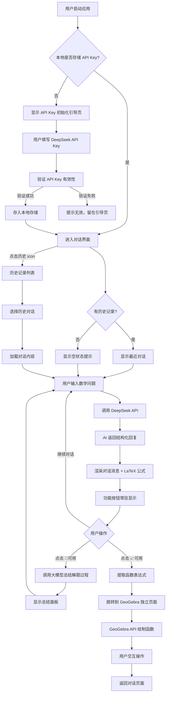

# PRD：MathLearningTool — 高数函数图像解题工具

> 版本：v1.2 | 作者：许清楚（Xu）| 日期：2026-06-07

---

## 1. 项目信息

| 字段 | 值 |
|------|------|
| 项目名称 | MathLearningTool |
| 技术栈 | UniApp + H5 + 微信小程序（局域网部署） |
| 项目格式 | snake_case |
| 原始需求 | 高数函数图像解题工具，包含 GeoGebra 交互界面和 AI 对话解题界面，支持 LaTeX 公式渲染、历史对话持久化、解题过程总结、函数图像联动 GeoGebra |
| 大模型 API | DeepSeek（用户首次登录填写 API Key 初始化） |
| 部署方式 | 局域网部署，不上传微信小程序；GeoGebra WebView 服务器配置到本地 |

---

## 2. 产品定义

### 2.1 产品目标

1. **可视化解题**：将抽象的高等数学问题（极限、导数、积分等）与函数图像关联，帮助学生直观理解数学概念
2. **智能解题辅助**：通过 AI 大模型输出完整的解题过程，降低高数学习门槛，提升自学效率
3. **交互式探索**：借助 GeoGebra 的动态几何能力，让用户可以交互式地调整函数参数，加深对函数行为的理解

### 2.2 用户故事

1. **作为** 大一学生，**我希望** 输入一道极限题目后，AI 能给出完整的解题过程并自动判断是否可绘制函数图像，**以便** 我同时获得解题思路和直观的图形理解
2. **作为** 备考学生，**我希望** 能将 AI 的解题过程总结为适合手写的书面格式，**以便** 我可以将其整理到笔记本中复习
3. **作为** 数学学习者，**我希望** AI 识别出的函数能一键发送到 GeoGebra 进行交互探索，**以便** 我能通过缩放、拖拽等方式深入理解函数的行为
4. **作为** 长期用户，**我希望** 过往的对话记录能被持久化保存且可随时切换，**以便** 我能回顾之前的学习内容
5. **作为** 高数初学者，**我希望** 对话中的数学公式能以标准数学排版显示，**以便** 我能清晰阅读解题过程中的公式

---

## 3. 已确认决策

以下为用户已确认的产品与技术决策，作为后续设计和开发的约束基准：

| 编号 | 决策项 | 决策内容 |
|------|--------|----------|
| D1 | 大模型 API | 默认使用 DeepSeek；用户首次进入时需填写 API Key 进行初始化 |
| D2 | GeoGebra 布局 | GeoGebra 是独立页面；对话过程中产出的函数公式，点击"发送到 GeoGebra"按钮后将函数渲染到 GeoGebra 并跳转到 GeoGebra 页面 |
| D3 | 部署方式 | 项目部署在局域网，不上传微信小程序；GeoGebra WebView 服务器配置到本地；使用 .env 文件存储所有配置项 |
| D4 | LaTeX 解析 | 使用 KaTeX + WebView |
| D5 | 功能按钮显示策略 | 📝总结 和 📈发送到 GeoGebra 两个按钮**常驻显示**，在没有总结出来或没有函数图像时灰度 disable（而非隐藏） |
| D6 | Git 提交语言 | 中文 |
| D7 | 技术框架 | 使用 UniApp 开发，优先兼容 H5 端，后续兼容微信小程序端（使用局域网 webview） |
| D8 | 主题色调 | 暂定，作为可配置项 |
| D9 | 历史对话存储 | 前端本地存储（localStorage / uni.setStorageSync），支持导出 JSON 备份 |
| D10 | AI 返回格式容错 | 静默降级 — 解析函数表达式失败时，"发送到 GeoGebra"按钮灰度 disable，不额外提示 |
| D11 | GeoGebra 跳转交互 | 点击按钮后跳转到 GeoGebra 独立页面，函数自动渲染 |
| D12 | API Key 存储 | 浏览器本地存储（localStorage），每个用户自己填写 |
| D13 | iPad/横屏适配 | UniApp 自然支持的响应式布局，不额外做平板优化 |
| D14 | 历史对话存储清理策略 | 最大对话保存数量为 10，超过自动清理队列最早的一条（FIFO） |
| D15 | GeoGebra 多函数策略 | 每次新建会话重置渲染，不叠加多函数 |
| D16 | 解题过程导出含义 | P2-2"解题过程导出"的含义是让大模型在对话中输出完整的数学解题过程，是一次对话交互，不需要产出图片/文件等额外产物 |

---

## 4. 需求池

### P0 — 必须有（MVP 核心）

| 编号 | 需求 | 说明 |
|------|------|------|
| P0-1 | AI 对话解题界面 | 核心对话 UI，支持用户输入数学问题、展示 AI 回复 |
| P0-2 | 系统提示词设计 | AI 同时输出：解题过程 + 是否可绘图判断 + 函数表达式 |
| P0-3 | LaTeX 公式渲染 | 使用 KaTeX + WebView 对话中正确解析并渲染 LaTeX 数学公式 |
| P0-4 | GeoGebra 交互界面 | GeoGebra 为独立页面，支持函数图像绘制与交互操作 |
| P0-5 | 函数发送到 GeoGebra | 从对话界面将函数表达式传递给 GeoGebra 独立页面并自动绘图 |
| P0-6 | 历史对话持久化 | 前端本地存储（localStorage / uni.setStorageSync），支持导出 JSON 备份，最大保存 10 条对话（FIFO） |
| P0-7 | API Key 初始化流程 | 首次进入时引导用户填写 DeepSeek API Key，存入本地，验证后进入对话界面 |

### P1 — 应该有

| 编号 | 需求 | 说明 |
|------|------|------|
| P1-1 | 总结解题过程 | 调用大模型输出适合手写的完整书面解题步骤 |
| P1-2 | 历史记录入口 | 左上角显示历史记录 icon，点击可查看和切换历史对话 |
| P1-3 | 功能按钮常驻显示 | 📝总结 和 📈发送到 GeoGebra 两个按钮常驻显示，无内容时灰度 disable |

### P2 — 可以有

| 编号 | 需求 | 说明 |
|------|------|------|
| P2-1 | 对话搜索 | 在历史记录中搜索关键词 |
| P2-2 | 解题过程导出 | 让大模型在对话中输出完整的数学解题过程，是一次对话交互，不需要产出图片/文件等额外产物 |
| P2-3 | 深色模式 | 适配深色模式 |
| P2-4 | 主题色配置 | 支持通过 .env 配置主题色调 |

---

## 5. 功能详细说明

### 5.1 API Key 初始化流程

用户首次进入应用时，需完成 API Key 初始化：

```
启动应用 → 检查本地是否存储 API Key
  ├─ 已存储 → 进入对话界面
  └─ 未存储 → 显示 API Key 初始化引导页
                → 用户填写 DeepSeek API Key
                → 点击"验证并保存"
                → 调用 DeepSeek API 发送测试请求验证 Key 有效性
                  ├─ 验证成功 → 存入 localStorage → 进入对话界面
                  └─ 验证失败 → 提示"API Key 无效，请检查后重试" → 留在引导页
```

**初始化引导页要素**：
- DeepSeek API Key 输入框（密码类型，可切换显示）
- "验证并保存"按钮
- 简要说明文字：如何获取 DeepSeek API Key（含链接）
- 验证中显示 loading 状态

**API Key 存储**：
- 使用 `localStorage`（H5）/ `uni.setStorageSync`（小程序）存储
- Key 为 `deepseek_api_key`
- 用户可在设置中随时修改 API Key

### 5.2 GeoGebra 交互界面

#### 5.2.1 嵌入方案

**确认方案：GeoGebra 独立页面**

GeoGebra 作为独立页面存在，而非嵌入在对话页面中。用户在对话过程中产出的函数公式，点击"发送到 GeoGebra"按钮后，函数渲染到 GeoGebra 页面并跳转到该页面。

具体实现路径：

1. **页面结构**：对话页面与 GeoGebra 页面为两个独立页面
2. **GeoGebra 加载**：使用 WebView 组件加载本地 GeoGebra 中间页（中间页内嵌 GeoGebra JavaScript API）
3. **通信机制**：
   - H5 端：通过 URL 参数传递函数表达式，GeoGebra 页面解析参数后调用 API 绘图
   - 小程序端：通过 URL 参数 + `evalJS` 向 WebView 注入命令
4. **函数渲染**：点击"发送到 GeoGebra"后，跳转到 GeoGebra 独立页面并将函数表达式作为参数传入，调用 `evalCommand("f(x) = ...")` 绘制函数图像
5. **跳转交互**：跳转到 GeoGebra 页面后函数自动渲染，用户可交互操作；通过返回按钮回到对话页面

**关键约束**：
- GeoGebra WebView 服务器配置到本地（局域网地址），通过 .env 文件配置服务地址
- 项目部署在局域网，不上传微信小程序
- 后续兼容微信小程序端时使用局域网 webview 方案
- 每次新建会话重置 GeoGebra 渲染，不叠加多函数（D15）

#### 5.2.2 交互能力

- 函数绘制：输入函数表达式自动绘制图像
- 缩放/平移：支持手势缩放和拖拽坐标系
- 参数调整：可选支持滑块参数（如 `y = a*sin(x)` 中的 `a`）
- 截图：支持将当前 GeoGebra 画面截图保存

#### 5.2.3 与对话界面的联动机制

```
对话界面 → [点击 📈 按钮] → 提取函数表达式
  → 跳转到 GeoGebra 独立页面（函数表达式作为参数）
  → GeoGebra 页面加载 → API 绘制函数图像
  → 用户交互操作 → 点击返回回到对话页面
```

- 用户在对话界面点击"发送到 GeoGebra"按钮
- 前端提取当前函数表达式（如 `y = 1/x`）
- 跳转到 GeoGebra 独立页面，函数表达式作为 URL 参数传递
- GeoGebra 页面解析参数，调用 `evalCommand` 绘制函数图像
- 用户在 GeoGebra 页面交互操作，完成后通过返回按钮回到对话页面

### 5.3 AI 对话解题界面

#### 5.3.1 界面布局

```
┌─────────────────────────────────┐
│  [历史记录]    高数函数图像解题    │  ← 顶部导航栏
├─────────────────────────────────┤
│                                 │
│   用户: lim 1/x = ?            │  ← 对话消息区
│                                 │
│   AI: 解题过程...               │
│   $$\lim_{x\to\infty}\frac{1}{x}$$ │  ← LaTeX 渲染
│   可绘制函数: y = 1/x          │
│                                 │
│               [📝灰度] [📈可用]  │  ← 功能按钮常驻（灰度/可用）
│                                 │
├─────────────────────────────────┤
│  [输入框]              [发送]   │  ← 底部输入区
└─────────────────────────────────┘

（GeoGebra 为独立页面，点击 📈 按钮后跳转）
```

- **顶部导航栏**：左上角历史记录 icon（时钟图标），中间标题
- **对话区**：滚动消息列表，用户消息右对齐，AI 消息左对齐
- **功能按钮**：📝总结 和 📈发送到 GeoGebra **常驻显示**
  - 📝总结：有总结内容时可用，未总结时灰度 disable
  - 📈发送到 GeoGebra：AI 判断可绘图且函数表达式解析成功时可用，否则灰度 disable
  - 解析函数表达式失败时**静默降级**，按钮灰度 disable，不额外提示错误
- **底部输入区**：文本输入框 + 发送按钮

#### 5.3.2 历史对话持久化方案

**存储策略**：

| 维度 | 方案 |
|------|------|
| 存储引擎 | `localStorage`（H5）/ `uni.setStorageSync`（微信小程序本地缓存） |
| 存储上限 | 微信小程序单个 key 上限 1MB，总上限 10MB；H5 端取决于浏览器（通常 5-10MB） |
| 数据结构 | 每条对话为一个对象，包含 `id`、`title`、`messages[]`、`functions[]`、`createdAt`、`updatedAt` |
| 分页策略 | 每条对话单独存储为一个 key（`chat_${id}`），历史列表存为 `chat_list` |
| 容量管理 | 当存储接近上限时提示用户清理；支持删除单条历史 |
| 导出备份 | 支持将历史对话导出为 JSON 文件 |
| 对话数量上限 | 最大保存 10 条对话，超过自动清理队列最早的一条（FIFO）（D14） |
| 单对话消息数 | 建议单个对话不超过 100 条消息 |

**数据结构示例**：

```json
{
  "id": "chat_1705000000",
  "title": "lim 1/x 的求解",
  "messages": [
    { "role": "user", "content": "lim 1/x = ?", "timestamp": 1705000000 },
    { "role": "assistant", "content": "解题过程...", "latex": ["\\lim_{x\\to\\infty}\\frac{1}{x}"], "hasFunction": true, "functionExpr": "1/x", "timestamp": 1705000001 }
  ],
  "createdAt": 1705000000,
  "updatedAt": 1705000001
}
```

#### 5.3.3 系统提示词（System Prompt）设计

```
你是一个高等数学解题助手。你的任务是：

1. 解答用户提出的高等数学问题，输出完整的解题过程
2. 判断该问题是否涉及可绘制的函数图像
3. 如果涉及函数图像，输出标准函数表达式

输出格式要求：
- 使用 LaTeX 语法书写数学公式，用 $...$ 包裹行内公式，用 $$...$$ 包裹独立公式
- 解题过程需清晰分步，每步标注所用定理或方法

输出结构：
【解题过程】
（分步解题，含 LaTeX 公式）

【图像判断】
可绘制 / 不可绘制

【函数表达式】
（如果可绘制，输出如 y = f(x) 的标准表达式；如果不可绘制，输出"无"）

示例：
用户：lim 1/x = ?
回答：
【解题过程】
求 $\lim_{x \to \infty} \frac{1}{x}$

当 $x \to \infty$ 时，分母趋于无穷大，分子为常数 1。

$$\lim_{x \to \infty} \frac{1}{x} = 0$$

根据极限定义，当 $x$ 趋于无穷大时，$\frac{1}{x}$ 趋于 0。

【图像判断】
可绘制

【函数表达式】
y = 1/x
```

**提示词策略要点**：
- 强制 AI 以结构化格式输出，便于前端解析函数表达式和图像判断
- LaTeX 公式使用 `$...$` / `$$...$$` 标记，便于前端识别和渲染
- 解题过程与元信息（图像判断、函数表达式）分离，方便分别处理
- AI 返回格式不稳定时，前端静默降级：解析函数表达式失败则将"发送到 GeoGebra"按钮灰度 disable，不额外提示

#### 5.3.4 LaTeX 公式渲染方案

**确认方案：KaTeX + WebView**

| 方案 | 优点 | 缺点 | 推荐度 |
|------|------|------|--------|
| KaTeX + WebView | 渲染速度快、支持广泛 | 需 WebView 组件 | ★★★★★ |
| MathJax + WebView | 兼容性最好 | 渲染速度慢、体积大 | ★★★ |
| 自定义 rich-text | 原生渲染 | 实现复杂、覆盖不全 | ★★ |

**具体实现**：

1. 在 AI 消息渲染区域使用 WebView 组件
2. 推荐使用 `mp-html` 插件（UniApp 生态成熟插件），支持 LaTeX 公式渲染
   - 插件地址：`mp-html` 社区版支持微信小程序
   - 集成 KaTeX 预编译，将 LaTeX 转为 HTML 后通过 `rich-text` 渲染
3. 前端解析 AI 回复中的 `$...$` 和 `$$...$$` 标记，替换为 KaTeX 渲染后的 HTML

**备选方案**：
- 使用 `latex-parser` 将 LaTeX 转为图片，通过 `<image>` 组件显示
- 适用于极端兼容性需求，但体验较差

#### 5.3.5 功能按钮说明

**📝 总结解题过程**（常驻显示，灰度/可用）

- 常驻显示在 AI 消息区域右侧
- 当尚未生成总结时，按钮灰度 disable，不可点击
- 当已生成总结或可生成总结时，按钮可用
- 点击后调用大模型，传入当前对话上下文，附加提示词：

```
请将以下数学解题过程总结为适合书面手写的完整解题步骤，要求：
1. 格式规范，适合手写
2. 步骤完整，逻辑清晰
3. 使用 LaTeX 书写数学公式
4. 包含必要的文字说明
```

- 大模型返回总结内容后，在对话界面下方弹出展示面板，用户可阅读和复制
- 总结结果同时保存到当前对话记录中

**📈 发送到 GeoGebra**（常驻显示，灰度/可用）

- 常驻显示在 AI 消息区域右侧
- 当 AI 回复中【图像判断】不为"可绘制"或函数表达式解析失败时，按钮灰度 disable
- 当 AI 回复中【图像判断】为"可绘制"且函数表达式解析成功时，按钮可用
- 解析失败时**静默降级**，不额外提示错误信息
- 点击后提取【函数表达式】中的函数公式
- 跳转到 GeoGebra 独立页面，函数表达式作为参数传入，调用 `evalCommand` 绘制函数图像
- 用户在 GeoGebra 页面交互操作，完成后通过返回按钮回到对话页面

---

## 6. UI 交互流程图



---

## 7. .env 配置说明

所有环境相关配置项统一通过 `.env` 文件管理，不硬编码到源码中。

| 配置项 | 说明 | 示例值 |
|--------|------|--------|
| `VITE_GEOGEBRA_SERVER_URL` | GeoGebra WebView 中间页服务地址（本地局域网） | `http://192.168.1.100:8080/geogebra.html` |
| `VITE_DEEPSEEK_API_BASE_URL` | DeepSeek API 基础地址 | `https://api.deepseek.com` |
| `VITE_DEEPSEEK_MODEL` | DeepSeek 模型名称 | `deepseek-chat` |
| `VITE_APP_THEME_COLOR` | 主题色调（可配置） | `#1976D2` |
| `VITE_APP_TITLE` | 应用标题 | `高数函数图像解题工具` |
| `VITE_STORAGE_KEY_PREFIX` | 本地存储 Key 前缀 | `mlt_` |
| `VITE_MAX_CHAT_COUNT` | 最大对话保存数量 | `10` |
| `VITE_MAX_MESSAGES_PER_CHAT` | 单个对话最大消息数 | `100` |

**配置文件模板**（`.env.example`）：

```env
# GeoGebra 服务配置
VITE_GEOGEBRA_SERVER_URL=http://localhost:8080/geogebra.html

# DeepSeek API 配置
VITE_DEEPSEEK_API_BASE_URL=https://api.deepseek.com
VITE_DEEPSEEK_MODEL=deepseek-chat

# 应用配置
VITE_APP_THEME_COLOR=#1976D2
VITE_APP_TITLE=高数函数图像解题工具

# 存储配置
VITE_STORAGE_KEY_PREFIX=mlt_
VITE_MAX_CHAT_COUNT=10
VITE_MAX_MESSAGES_PER_CHAT=100
```

---

*文档结束*
