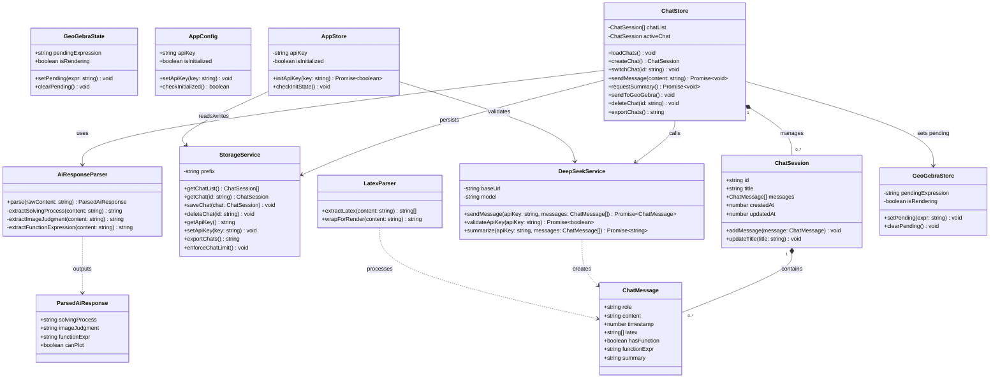
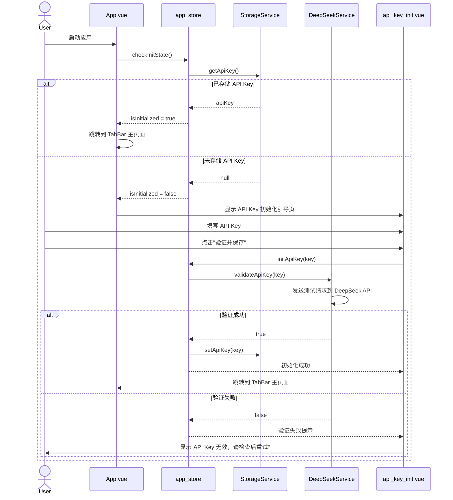
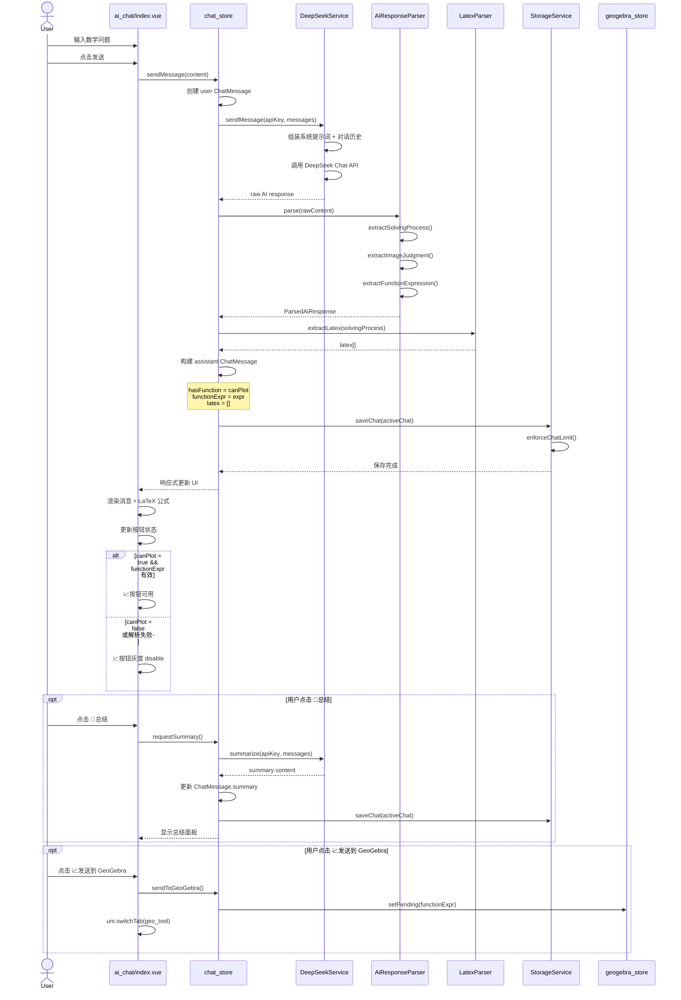
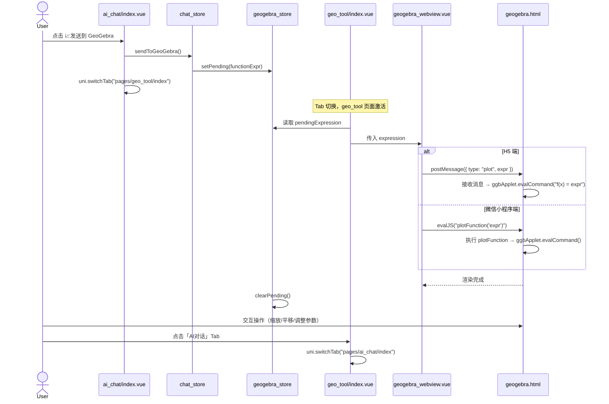
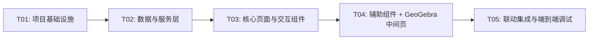

# MathLearningTool — 系统架构设计 v1.3

> 版本：v1.3 | 架构师：高见远（Bob）| 日期：2026-06-07

---

## Part A: 系统设计

### 1. 实现方案

#### 1.1 核心技术挑战

| 挑战 | 说明 | 解决方案 |
|------|------|----------|
| AI 结构化输出解析 | DeepSeek 返回的【解题过程】【图像判断】【函数表达式】格式不稳定 | 正则 + 容错解析器，解析失败时静默降级（按钮灰度） |
| GeoGebra 跨 Tab 通信 | Tab 切换后 WebView 需接收函数表达式 | Pinia 全局状态 + WebView `evalJS` / `postMessage` |
| LaTeX 公式渲染 | UniApp 原生组件不支持 LaTeX | mp-html 插件 + KaTeX 预编译，将 LaTeX 转 HTML 后 rich-text 渲染 |
| 历史对话 FIFO 管理 | localStorage 容量有限，需自动清理 | 单对话单 key 存储 + chat_list 索引，超 10 条自动移除最早记录 |
| H5 / 微信小程序双端兼容 | WebView 和存储 API 差异 | uni.setStorageSync / localStorage 双封装，WebView 通信条件判断 |

#### 1.2 框架选型

| 层次 | 选型 | 理由 |
|------|------|------|
| 前端框架 | **UniApp + Vue 3 + Vite** | PRD D7 决策；跨端（H5 + 微信小程序）；Vue 3 Composition API 更灵活 |
| 状态管理 | **Pinia** | Vue 3 官方推荐，TS 友好，轻量，模块化 Store 天然适合多 Tab 通信 |
| AI 对话 | **DeepSeek API** | PRD D1 决策；用户自填 API Key |
| 数学绘图 | **GeoGebra (WebView)** | PRD D2/D4 决策；本地局域网部署中间页 |
| LaTeX 渲染 | **mp-html + KaTeX** | PRD D4 决策；mp-html 是 UniApp 生态成熟插件，内置 KaTeX 支持 |
| 持久化 | **uni.setStorageSync / localStorage** | PRD D9 决策；封装 StorageService 屏蔽双端差异 |
| 主题 | **CSS Variables (Skland Theme)** | PRD D8 决策；已有 `HYPERGRYPH-Skland-Theme.css` 变量体系 |

#### 1.3 架构模式

采用 **MVVM + 服务层** 架构：

```
View (Vue 组件)
  ↕ 响应式绑定
ViewModel (Pinia Store)
  ↕ 调用
Service (业务服务层)
  ↕ 调用
External (DeepSeek API / GeoGebra WebView / localStorage)
```

- **View**：UniApp 页面和组件，负责 UI 渲染和用户交互
- **ViewModel**：Pinia Store，管理应用状态，提供 computed 和 actions
- **Service**：纯业务逻辑，不依赖 UI（DeepSeek 请求、存储操作、AI 响应解析）
- **External**：外部依赖（API、WebView、本地存储）

---

### 2. 文件列表

```
MathLearningTool/
├── .env                              # 环境变量（不提交 Git）
├── .env.example                      # 环境变量模板
├── .gitignore
├── index.html                        # Vite 入口 HTML
├── package.json
├── tsconfig.json
├── vite.config.ts
├── src/
│   ├── App.vue                       # 应用根组件
│   ├── main.ts                       # 应用入口
│   ├── manifest.json                 # UniApp 应用配置
│   ├── pages.json                    # 页面路由 + TabBar 配置
│   ├── uni.scss                      # UniApp 全局 SCSS 变量
│   ├── assets/
│   │   └── styles/
│   │       ├── HYPERGRYPH-Skland-Theme.css   # DAyQ 主题原始变量
│   │       └── global.css                    # 全局样式 + 语义别名覆盖
│   ├── components/
│   │   ├── action_buttons.vue        # 📝总结 + 📈发送到 GeoGebra 按钮
│   │   ├── chat_input.vue            # 底部输入框 + 发送按钮
│   │   ├── chat_message.vue          # 单条对话消息（用户/AI）
│   │   ├── geogebra_webview.vue      # GeoGebra WebView 容器
│   │   ├── history_drawer.vue        # 历史记录抽屉面板
│   │   ├── latex_renderer.vue        # LaTeX 公式渲染（mp-html 封装）
│   │   └── summary_panel.vue         # 总结结果展示面板
│   ├── pages/
│   │   ├── ai_chat/
│   │   │   └── index.vue             # AI对话 Tab 页面
│   │   ├── geo_tool/
│   │   │   └── index.vue             # Geo工具 Tab 页面
│   │   └── init/
│   │       └── api_key_init.vue      # API Key 初始化引导页
│   ├── services/
│   │   ├── ai_response_parser.ts     # AI 结构化响应解析器
│   │   ├── deepseek_service.ts       # DeepSeek API 封装
│   │   ├── latex_parser.ts           # LaTeX 公式提取与预处理
│   │   └── storage_service.ts        # 本地存储封装（双端兼容）
│   ├── stores/
│   │   ├── app_store.ts              # 全局应用状态（API Key、初始化状态）
│   │   ├── chat_store.ts             # 对话状态管理（消息、会话列表）
│   │   └── geogebra_store.ts         # GeoGebra 状态（待渲染函数表达式）
│   ├── types/
│   │   └── index.ts                  # 全局类型定义
│   └── utils/
│       ├── constants.ts              # 常量（存储 key、默认值等）
│       └── env_config.ts             # .env 配置读取封装
├── static/
│   └── geogebra/
│       └── geogebra.html             # GeoGebra 中间页（WebView 加载）
└── docs/
    ├── architecture-v1.3.md          # 本文档
    ├── class-diagram.mermaid         # 类图
    └── sequence-diagram.mermaid      # 时序图
```

---

### 3. 数据结构和接口



#### 核心类型定义 (`types/index.ts`)

```typescript
/** 对话消息 */
interface ChatMessage {
  role: 'user' | 'assistant' | 'system'
  content: string
  timestamp: number
  /** AI 回复中提取的 LaTeX 公式列表 */
  latex?: string[]
  /** AI 判断是否可绘制函数图像 */
  hasFunction?: boolean
  /** 提取的函数表达式，如 "1/x" */
  functionExpr?: string
  /** 总结内容 */
  summary?: string
}

/** 对话会话 */
interface ChatSession {
  id: string
  title: string
  messages: ChatMessage[]
  createdAt: number
  updatedAt: number
}

/** AI 响应解析结果 */
interface ParsedAiResponse {
  solvingProcess: string
  imageJudgment: string
  functionExpr: string
  canPlot: boolean
}

/** 历史记录列表项（轻量） */
interface ChatListItem {
  id: string
  title: string
  updatedAt: number
}
```

#### 服务接口详细设计

**StorageService**

| 方法 | 说明 | 返回值 |
|------|------|--------|
| `getChatList()` | 获取对话列表索引 | `ChatListItem[]` |
| `getChat(id)` | 获取完整对话 | `ChatSession \| null` |
| `saveChat(chat)` | 保存/更新对话，触发 FIFO 检查 | `void` |
| `deleteChat(id)` | 删除对话 | `void` |
| `getApiKey()` | 读取 API Key | `string` |
| `setApiKey(key)` | 保存 API Key | `void` |
| `exportChats()` | 导出全部对话为 JSON 字符串 | `string` |
| `enforceChatLimit()` | FIFO 检查，超出 `VITE_MAX_CHAT_COUNT` 时删除最早记录 | `void` |

**DeepSeekService**

| 方法 | 说明 | 返回值 |
|------|------|--------|
| `sendMessage(apiKey, messages)` | 发送对话消息（含系统提示词） | `Promise<ChatMessage>` |
| `validateApiKey(apiKey)` | 验证 API Key 有效性 | `Promise<boolean>` |
| `summarize(apiKey, messages)` | 总结解题过程 | `Promise<string>` |

**AiResponseParser**

| 方法 | 说明 | 返回值 |
|------|------|--------|
| `parse(rawContent)` | 解析 AI 原始回复为结构化对象 | `ParsedAiResponse` |
| `extractSolvingProcess(content)` | 提取【解题过程】 | `string` |
| `extractImageJudgment(content)` | 提取【图像判断】 | `string` |
| `extractFunctionExpression(content)` | 提取【函数表达式】 | `string` |

**LatexParser**

| 方法 | 说明 | 返回值 |
|------|------|--------|
| `extractLatex(content)` | 提取 `$...$` 和 `$$...$$` 包裹的 LaTeX | `string[]` |
| `wrapForRender(content)` | 将 AI 回复中的 LaTeX 标记转为 mp-html 可渲染格式 | `string` |

---

### 4. 程序调用流程

#### 4.1 API Key 初始化流程



#### 4.2 AI 对话流程



#### 4.3 GeoGebra 联动流程



---

### 5. 待明确事项

| 编号 | 事项 | 当前假设 | 建议 |
|------|------|----------|------|
| U1 | GeoGebra 中间页 `geogebra.html` 是否需要项目内提供 | 假设需在 `static/geogebra/` 下提供模板 | 需确认是独立部署还是项目内置 |
| U2 | DeepSeek API 调用失败时的重试策略 | 不重试，直接显示错误提示 | 建议加 1 次自动重试 |
| U3 | 总结面板的展示形式 | 底部弹出面板（Drawer） | 可后续调整为内联展示 |
| U4 | 历史记录导出 JSON 的触发方式 | 历史记录面板中的导出按钮 | 需确认是否需要文件名自定义 |
| U5 | GeoGebra WebView 加载失败时的降级方案 | 显示加载失败提示 | 建议加"刷新"按钮 |
| U6 | mp-html 插件版本和 LaTeX 扩展支持范围 | 使用社区版 + KaTeX 扩展 | 需验证 KaTeX 对高数公式的覆盖度 |
| U7 | 多条 AI 回复中多条函数表达式的处理 | 仅取最后一条可绘制的函数 | 建议取最后一条，符合 D15 决策 |

---

## Part B: 任务分解

### 6. 依赖包列表

```
# 核心框架
- @dcloudio/vite-plugin-uni: ^4.x          # UniApp Vite 插件
- @dcloudio/uni-app: ^4.x                  # UniApp 核心
- @dcloudio/uni-app-plus: ^4.x             # UniApp App 端
- @dcloudio/uni-h5: ^4.x                   # UniApp H5 端
- @dcloudio/uni-mp-weixin: ^4.x            # UniApp 微信小程序端
- vue: ^3.4.x                              # Vue 3
- vite: ^5.x                               # Vite 构建工具

# 状态管理
- pinia: ^2.1.x                            # Vue 3 官方状态管理
- pinia-plugin-unistorage: ^0.1.x          # Pinia 持久化插件（可选）

# UI / 渲染
- mp-html: ^2.5.x                          # 富文本渲染 + LaTeX/KaTeX 支持

# 工具
- typescript: ^5.x                         # TypeScript
- @types/node: ^20.x                       # Node 类型
```

---

### 7. 任务列表

#### T01: 项目基础设施

| 字段 | 值 |
|------|------|
| **任务名称** | 项目基础设施（配置文件 + 入口文件 + 类型定义 + 主题样式） |
| **优先级** | P0 |
| **源文件** | `package.json`, `vite.config.ts`, `tsconfig.json`, `index.html`, `.env`, `.env.example`, `.gitignore`, `src/main.ts`, `src/App.vue`, `src/manifest.json`, `src/pages.json`, `src/uni.scss`, `src/assets/styles/HYPERGRYPH-Skland-Theme.css`, `src/assets/styles/global.css`, `src/types/index.ts`, `src/utils/constants.ts`, `src/utils/env_config.ts` |
| **依赖** | 无 |

**详细说明**：
- 创建 UniApp + Vue 3 + Vite 项目脚手架
- 配置 `pages.json`（含 TabBar：Geo工具 + AI对话，及 init 页面路由）
- 配置 `manifest.json`（应用名称、appid 等）
- 安装所有依赖包（pinia, mp-html 等）
- 将 `HYPERGRYPH-Skland-Theme.css` 迁入 `src/assets/styles/`
- 创建 `global.css`，引入主题变量，定义全局基础样式
- 创建 `types/index.ts`，定义 `ChatMessage`, `ChatSession`, `ParsedAiResponse`, `ChatListItem` 类型
- 创建 `utils/constants.ts`（存储 key 前缀、默认值等）
- 创建 `utils/env_config.ts`（读取 `import.meta.env` 中的 `.env` 配置）
- 创建 `.env` 和 `.env.example`
- 创建 `App.vue`（含 API Key 初始化检查逻辑，跳转 init 页面或主页面）
- 创建 `main.ts`（注册 Pinia）

---

#### T02: 数据与服务层

| 字段 | 值 |
|------|------|
| **任务名称** | 数据与服务层（Pinia Store + 业务 Service） |
| **优先级** | P0 |
| **源文件** | `src/stores/app_store.ts`, `src/stores/chat_store.ts`, `src/stores/geogebra_store.ts`, `src/services/storage_service.ts`, `src/services/deepseek_service.ts`, `src/services/ai_response_parser.ts`, `src/services/latex_parser.ts` |
| **依赖** | T01 |

**详细说明**：
- **StorageService**：封装 `localStorage` / `uni.setStorageSync` 双端兼容接口；实现 `getChatList`, `getChat`, `saveChat`, `deleteChat`, `getApiKey`, `setApiKey`, `exportChats`, `enforceChatLimit`（FIFO 逻辑：超过 `VITE_MAX_CHAT_COUNT` 自动删除最早记录）
- **DeepSeekService**：封装 DeepSeek Chat API；实现 `sendMessage`（含系统提示词注入）、`validateApiKey`（发送测试请求）、`summarize`（总结提示词注入）；流式/非流式响应处理
- **AiResponseParser**：解析 AI 原始回复中的【解题过程】【图像判断】【函数表达式】；正则提取 + 容错（格式不完整时 canPlot = false）；`extractFunctionExpression` 清理 `y = ` 前缀，返回纯表达式
- **LatexParser**：提取 `$...$` 和 `$$...$$` 中的 LaTeX 公式；将 LaTeX 标记转为 mp-html 可识别的格式
- **AppStore**：管理 API Key 状态和初始化检查；`initApiKey` → 调用 DeepSeekService 验证 → 成功则保存；`checkInitState` → 读取 StorageService
- **ChatStore**：管理对话列表和当前活跃对话；`sendMessage` → 调用 DeepSeekService → 解析 → 存储；`requestSummary` → 调用 DeepSeekService.summarize；`sendToGeoGebra` → 写入 GeoGebraStore；`createChat`, `switchChat`, `deleteChat`, `exportChats`
- **GeoGebraStore**：管理待渲染函数表达式；`setPending(expr)`, `clearPending()`

---

#### T03: 核心页面与交互组件

| 字段 | 值 |
|------|------|
| **任务名称** | 核心页面与交互组件（3 个页面 + 3 个核心组件） |
| **优先级** | P0 |
| **源文件** | `src/pages/init/api_key_init.vue`, `src/pages/ai_chat/index.vue`, `src/pages/geo_tool/index.vue`, `src/components/chat_message.vue`, `src/components/chat_input.vue`, `src/components/geogebra_webview.vue` |
| **依赖** | T02 |

**详细说明**：
- **api_key_init.vue**：API Key 初始化引导页；输入框（密码类型 + 显示切换）、验证并保存按钮、loading 状态、DeepSeek Key 获取说明；验证成功跳转主页面
- **ai_chat/index.vue**：AI 对话 Tab 主页面；顶部导航栏（历史记录 icon + 标题）；消息列表（滚动区域，用户右对齐/AI 左对齐）；功能按钮区（📝📈常驻）；底部输入区；从 ChatStore 读取数据，调用 ChatStore actions
- **geo_tool/index.vue**：Geo 工具 Tab 主页面；顶部导航栏（标题）；GeoGebra WebView 全屏展示区；从 GeoGebraStore 读取 pendingExpression，传递给 geogebra_webview；onShow 时检测待渲染函数
- **chat_message.vue**：单条消息渲染组件；用户消息和 AI 消息区分样式；AI 消息中嵌入 latex_renderer；显示函数表达式标签（可绘制时）
- **chat_input.vue**：底部输入组件；textarea + 发送按钮；发送中 loading 状态；Enter 发送
- **geogebra_webview.vue**：GeoGebra WebView 容器；加载 `.env` 中配置的 GeoGebra 中间页 URL；接收 expression prop，通过 `postMessage`/`evalJS` 传递绘图命令；H5 / 小程序端通信兼容

---

#### T04: 辅助组件 + GeoGebra 中间页

| 字段 | 值 |
|------|------|
| **任务名称** | 辅助 UI 组件 + GeoGebra 中间页 + 样式完善 |
| **优先级** | P1 |
| **源文件** | `src/components/latex_renderer.vue`, `src/components/action_buttons.vue`, `src/components/summary_panel.vue`, `src/components/history_drawer.vue`, `static/geogebra/geogebra.html`, `src/assets/styles/global.css` |
| **依赖** | T03 |

**详细说明**：
- **latex_renderer.vue**：封装 mp-html 组件，配置 KaTeX 扩展；接收 content（含 LaTeX 标记的文本），调用 LatexParser.wrapForRender 预处理后渲染；样式适配对话气泡宽度
- **action_buttons.vue**：📝总结 + 📈发送到 GeoGebra 常驻按钮组；接收 `canSummarize`, `canPlot` props 控制灰度/可用状态；emit `summary`, `sendToGeoGebra` 事件；按钮样式引用 CSS 变量
- **summary_panel.vue**：总结结果展示面板；底部抽屉式弹出；展示总结文本（含 LaTeX 渲染）；支持复制文本内容；关闭后回到对话界面
- **history_drawer.vue**：历史记录抽屉面板；左侧滑出；展示对话列表（标题 + 时间）；点击切换对话；删除按钮；导出 JSON 按钮；空状态提示
- **geogebra.html**：GeoGebra 中间页；加载 GeoGebra JavaScript API（从 CDN 或本地）；初始化 GGB Applet；监听 `postMessage` / 暴露 `plotFunction` 接口；调用 `ggbApplet.evalCommand("f(x) = expr")` 绘制函数；每次新函数先 `ggbApplet.removeAll()` 清空画布（D15）
- **global.css 完善**：补充对话气泡样式、按钮灰度样式、抽屉动画等全局样式

---

#### T05: 联动集成与端到端调试

| 字段 | 值 |
|------|------|
| **任务名称** | 联动集成与端到端调试（Tab 通信 + 完整流程 + 修复） |
| **优先级** | P1 |
| **源文件** | 涉及全部文件，主要为 `src/App.vue`, `src/pages/ai_chat/index.vue`, `src/pages/geo_tool/index.vue`, `src/stores/chat_store.ts`, `src/stores/geogebra_store.ts`, `src/components/geogebra_webview.vue`, `src/services/ai_response_parser.ts` |
| **依赖** | T04 |

**详细说明**：
- 集成 API Key 初始化 → 主页面跳转完整流程
- 集成 AI 对话 → 解析 → 按钮状态联动（📈 可用/灰度）
- 集成 📈按钮 → GeoGebraStore 写入 → switchTab → Geo 工具页读取 → WebView 传参 → 函数渲染
- 集成 📝总结按钮 → DeepSeek 总结 → summary_panel 展示
- 集成历史记录：创建/切换/删除/导出
- 验证 FIFO 清理逻辑
- 验证 LaTeX 公式渲染效果
- 验证 GeoGebra 每次新会话重置渲染（D15）
- H5 端全流程调试与修复
- AI 响应格式容错测试（解析失败时按钮灰度）

---

### 8. 共享知识

```
# 项目约定（跨文件，工程师必读）

## 命名
- 文件名：snake_case（如 chat_store.ts, ai_response_parser.ts）
- Vue 组件文件名：snake_case（如 chat_message.vue）
- CSS 类名：kebab-case（如 .chat-message, .action-buttons）
- TS 接口/类型：PascalCase（如 ChatMessage, ChatSession）
- TS 变量/函数：camelCase（如 sendMessage, parseResponse）
- 常量：UPPER_SNAKE_CASE（如 MAX_CHAT_COUNT）
- Pinia Store 文件：snake_case + _store 后缀（如 chat_store.ts）

## 主题色
- 所有颜色必须引用 CSS 变量（如 var(--color-primary)），不得硬编码色值
- 主色变量定义在 assets/styles/HYPERGRYPH-Skland-Theme.css
- 语义别名：--color-primary, --color-bg-page, --color-text-primary 等

## 配置
- 所有环境配置通过 .env 文件管理，代码中通过 import.meta.env.VITE_XXX 读取
- env_config.ts 封装读取逻辑，其他文件不直接访问 import.meta.env
- .env.example 提交到 Git，.env 不提交

## 存储
- 所有 localStorage 操作通过 StorageService 封装，不直接调用 localStorage API
- 存储 key 使用 VITE_STORAGE_KEY_PREFIX 前缀（默认 mlt_）
- 单对话单 key（mlt_chat_${id}），索引 key 为 mlt_chat_list

## API
- DeepSeek API Key 存储在 localStorage（mlt_deepseek_api_key）
- 所有 API 请求通过 DeepSeekService 发出，系统提示词在 Service 层注入
- API 调用失败不重试，直接在 UI 层显示错误提示

## AI 响应
- AI 返回结构化格式：【解题过程】【图像判断】【函数表达式】
- 解析失败时静默降级，按钮灰度 disable，不弹错误提示（D10）
- 函数表达式提取后去除 "y = " 前缀，保留纯表达式（如 "1/x"）

## GeoGebra
- GeoGebra 中间页地址通过 .env 的 VITE_GEOGEBRA_SERVER_URL 配置
- 每次新会话重置渲染，不叠加多函数（D15）
- 跨 Tab 通信通过 GeoGebraStore（Pinia）传递 pendingExpression

## Git
- 提交信息使用中文（D6）
- 提交格式："[类型] 简要描述"，如 "[feat] 新增 AI 对话页面"

## TabBar
- 底部 Tab 栏包含 2 个 Tab：「Geo工具」+ 「AI对话」（D17）
- 使用 uni.switchTab 切换，不是 navigateTo

## LaTeX
- LaTeX 公式使用 $...$（行内）和 $$...$$（独立）标记
- 渲染使用 mp-html + KaTeX 扩展
- LatexParser 负责将标记转为 mp-html 可识别格式
```

---

### 9. 任务依赖图



| 任务 | 优先级 | 依赖 | 预估复杂度 |
|------|--------|------|-----------|
| T01 | P0 | 无 | ★★☆ |
| T02 | P0 | T01 | ★★★ |
| T03 | P0 | T02 | ★★★★ |
| T04 | P1 | T03 | ★★★ |
| T05 | P1 | T04 | ★★★★ |

---

*文档结束*
